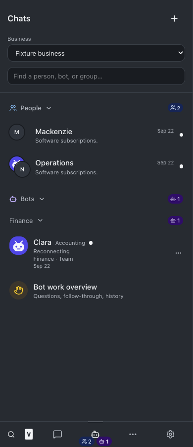
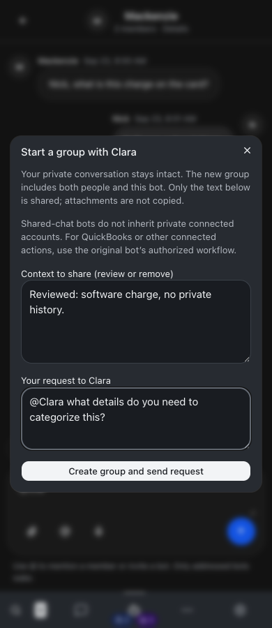
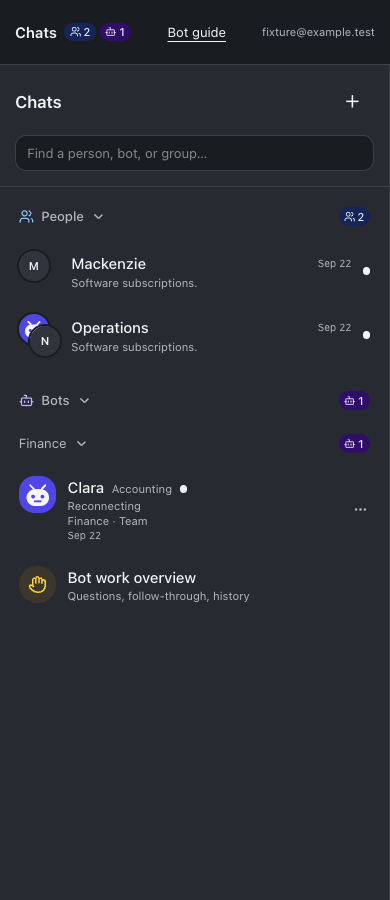

# Unified Chats

September 23, 2026

Chats has one People section and one Bots section. Mixed groups belong to People; bot teams and bot-only groups stay under Bots. Both sections preserve collapse preferences, and counts remain visible when collapsed. Navigation shows separate blue person and violet bot unread-conversation counts. The project conversation surface is labeled Workspace.

The + button handles human DMs, existing bots, and new groups. Typing @ offers current members and available bots. A bot invitation from a private DM previews editable context, preserves the original DM, and creates the group plus first request atomically. Retries do not duplicate groups or bot requests. Attachments stay in the original room. Each person must already have access to the bot; room membership does not grant connected-account access.

**Connected actions remain limited:** shared-room bots can read and reply with shared context. They do not inherit private integrations. QuickBooks changes still require the original connected bot and its existing approval flow. No real teammates were contacted and no financial action was performed during verification.

## Validation

- Root TypeScript validation and production build passed. Full test suite passed: 2,212 server tests (5 skipped), 859 web tests, 40 browser-manager tests, and 21 installer tests. The build emitted its existing large-chunk advisory.
- Earlier runs exposed obsolete navigation assertions, which were updated; an unrelated CDP test timed out once, then passed individually and in the final full run.
- Isolated browser checks passed at 320, 390, 768, and 1280 pixels, for full and restricted employees; included light/dark layouts, collapse persistence, counts by conversation, one occurrence per group, direct-message creation, context review, invitation, return navigation, and horizontal overflow checks.
- Full and restricted guide browser checks passed: navigation, announcement discovery, feature search, clipboard, deep links, refresh, announcement aging, and failure recovery.
- Server regression tests cover DM privacy, invitation retry deduplication, access-denial rollback, exact requesting-user identity, per-user read positions, and restricted employee invitation access. Existing room-worker restrictions remain intact.
- Resumed instruction tests confirm delivery of the new navigation and external-connection limits without changing fixed snapshots.

## Screenshots

## Changed files

- [web/src/screens/EmployeeWorkspace.test.tsx](/Users/archerclawdington/veneer-os/web/src/screens/EmployeeWorkspace.test.tsx)
- [docs/bot-feature-guide.md](/Users/archerclawdington/veneer-os/docs/bot-feature-guide.md)
- [scripts/bot-guide-browser-check.mjs](/Users/archerclawdington/veneer-os/scripts/bot-guide-browser-check.mjs)
- [scripts/unified-chats-browser-check.mjs](/Users/archerclawdington/veneer-os/scripts/unified-chats-browser-check.mjs)
- [server/src/bots/employeeAccess.ts](/Users/archerclawdington/veneer-os/server/src/bots/employeeAccess.ts)
- [server/src/featureGuide/catalog.ts](/Users/archerclawdington/veneer-os/server/src/featureGuide/catalog.ts)
- [server/src/rooms/routes.ts](/Users/archerclawdington/veneer-os/server/src/rooms/routes.ts)
- [server/src/rooms/service.ts](/Users/archerclawdington/veneer-os/server/src/rooms/service.ts)
- [server/test/instructionContext.test.ts](/Users/archerclawdington/veneer-os/server/test/instructionContext.test.ts)
- [server/test/teamRooms.test.ts](/Users/archerclawdington/veneer-os/server/test/teamRooms.test.ts)
- [web/src/App.tsx](/Users/archerclawdington/veneer-os/web/src/App.tsx)
- [web/src/components/BotConversationRail.tsx](/Users/archerclawdington/veneer-os/web/src/components/BotConversationRail.tsx)
- [web/src/components/ChatUnread.test.tsx](/Users/archerclawdington/veneer-os/web/src/components/ChatUnread.test.tsx)
- [web/src/components/ChatUnread.tsx](/Users/archerclawdington/veneer-os/web/src/components/ChatUnread.tsx)
- [web/src/components/GroupConversationRow.tsx](/Users/archerclawdington/veneer-os/web/src/components/GroupConversationRow.tsx)
- [web/src/components/NavBar.test.tsx](/Users/archerclawdington/veneer-os/web/src/components/NavBar.test.tsx)
- [web/src/components/NavBar.tsx](/Users/archerclawdington/veneer-os/web/src/components/NavBar.tsx)
- [web/src/components/NewGroupChat.tsx](/Users/archerclawdington/veneer-os/web/src/components/NewGroupChat.tsx)
- [web/src/lib/botGroups.ts](/Users/archerclawdington/veneer-os/web/src/lib/botGroups.ts)
- [web/src/lib/teamRooms.ts](/Users/archerclawdington/veneer-os/web/src/lib/teamRooms.ts)
- [web/src/screens/BotGuide.tsx](/Users/archerclawdington/veneer-os/web/src/screens/BotGuide.tsx)
- [web/src/screens/Bots.tsx](/Users/archerclawdington/veneer-os/web/src/screens/Bots.tsx)
- [web/src/screens/ChatList.tsx](/Users/archerclawdington/veneer-os/web/src/screens/ChatList.tsx)
- [web/src/screens/EmployeeWorkspace.test.tsx](/Users/archerclawdington/veneer-os/web/src/screens/EmployeeWorkspace.test.tsx)
- [web/src/screens/EmployeeWorkspace.tsx](/Users/archerclawdington/veneer-os/web/src/screens/EmployeeWorkspace.tsx)
- [web/src/screens/TeamMessages.tsx](/Users/archerclawdington/veneer-os/web/src/screens/TeamMessages.tsx)
- [Implementation report](/Users/archerclawdington/veneer-os/docs/reports/unified-chats/report.md)

All verification screenshots

- [docs/reports/unified-chats/guide/desktop.png](/Users/archerclawdington/veneer-os/docs/reports/unified-chats/guide/desktop.png)
- [docs/reports/unified-chats/guide/employee-mobile.png](/Users/archerclawdington/veneer-os/docs/reports/unified-chats/guide/employee-mobile.png)
- [docs/reports/unified-chats/invite-1280-employee.png](/Users/archerclawdington/veneer-os/docs/reports/unified-chats/invite-1280-employee.png)
- [docs/reports/unified-chats/invite-1280-owner.png](/Users/archerclawdington/veneer-os/docs/reports/unified-chats/invite-1280-owner.png)
- [docs/reports/unified-chats/invite-320-employee.png](/Users/archerclawdington/veneer-os/docs/reports/unified-chats/invite-320-employee.png)
- [docs/reports/unified-chats/invite-320-owner.png](/Users/archerclawdington/veneer-os/docs/reports/unified-chats/invite-320-owner.png)
- [docs/reports/unified-chats/invite-390-employee.png](/Users/archerclawdington/veneer-os/docs/reports/unified-chats/invite-390-employee.png)
- [docs/reports/unified-chats/invite-390-owner.png](/Users/archerclawdington/veneer-os/docs/reports/unified-chats/invite-390-owner.png)
- [docs/reports/unified-chats/invite-768-employee.png](/Users/archerclawdington/veneer-os/docs/reports/unified-chats/invite-768-employee.png)
- [docs/reports/unified-chats/invite-768-owner.png](/Users/archerclawdington/veneer-os/docs/reports/unified-chats/invite-768-owner.png)
- [docs/reports/unified-chats/list-1280-employee.png](/Users/archerclawdington/veneer-os/docs/reports/unified-chats/list-1280-employee.png)
- [docs/reports/unified-chats/list-1280-owner.png](/Users/archerclawdington/veneer-os/docs/reports/unified-chats/list-1280-owner.png)
- [docs/reports/unified-chats/list-320-employee.png](/Users/archerclawdington/veneer-os/docs/reports/unified-chats/list-320-employee.png)
- [docs/reports/unified-chats/list-320-owner.png](/Users/archerclawdington/veneer-os/docs/reports/unified-chats/list-320-owner.png)
- [docs/reports/unified-chats/list-390-employee.png](/Users/archerclawdington/veneer-os/docs/reports/unified-chats/list-390-employee.png)
- [docs/reports/unified-chats/list-390-owner.png](/Users/archerclawdington/veneer-os/docs/reports/unified-chats/list-390-owner.png)
- [docs/reports/unified-chats/list-768-employee.png](/Users/archerclawdington/veneer-os/docs/reports/unified-chats/list-768-employee.png)
- [docs/reports/unified-chats/list-768-owner.png](/Users/archerclawdington/veneer-os/docs/reports/unified-chats/list-768-owner.png)

