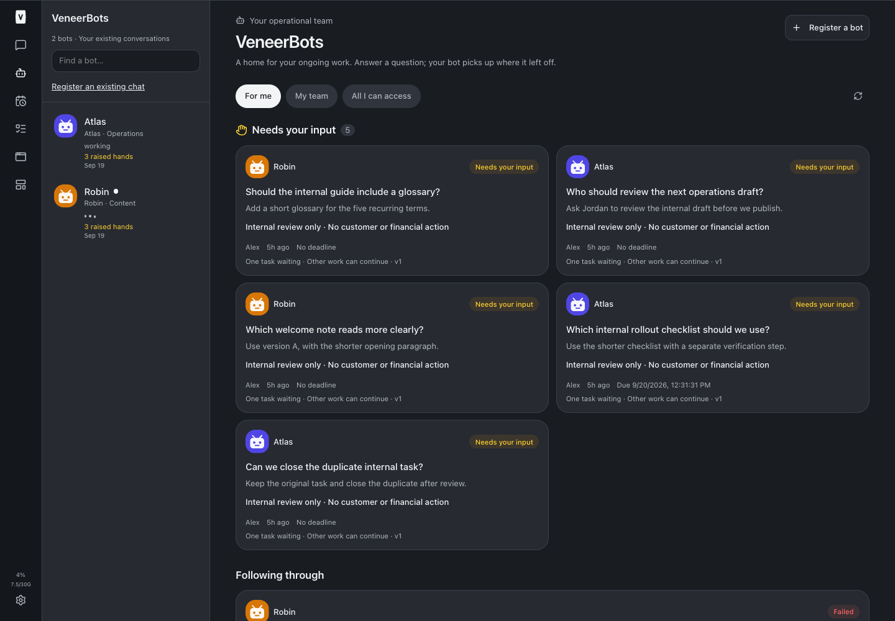
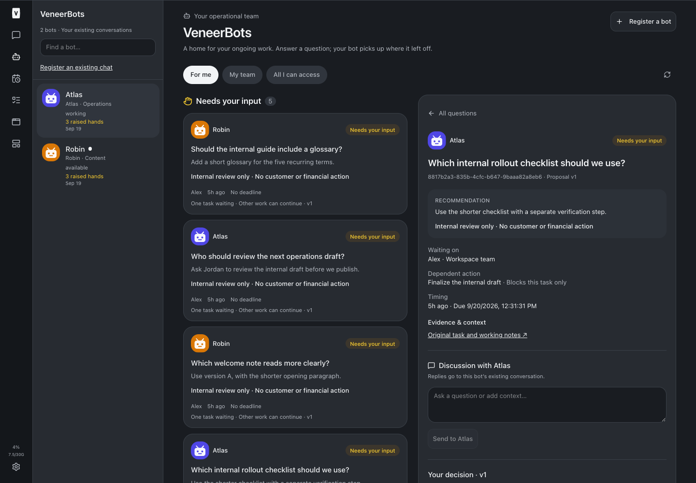
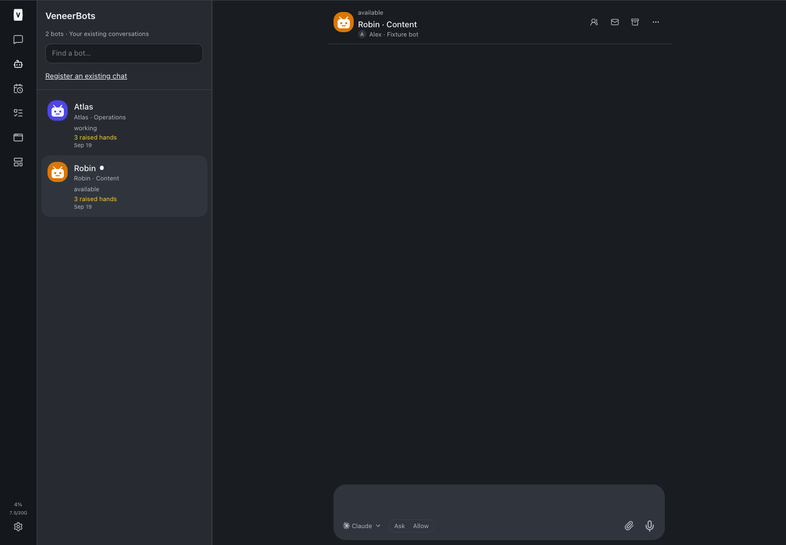
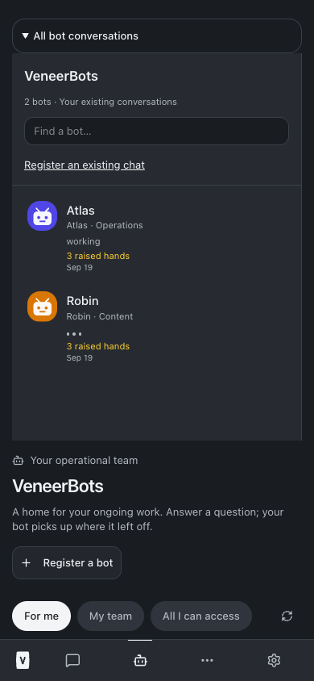
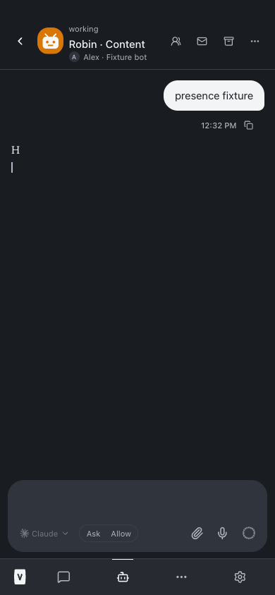
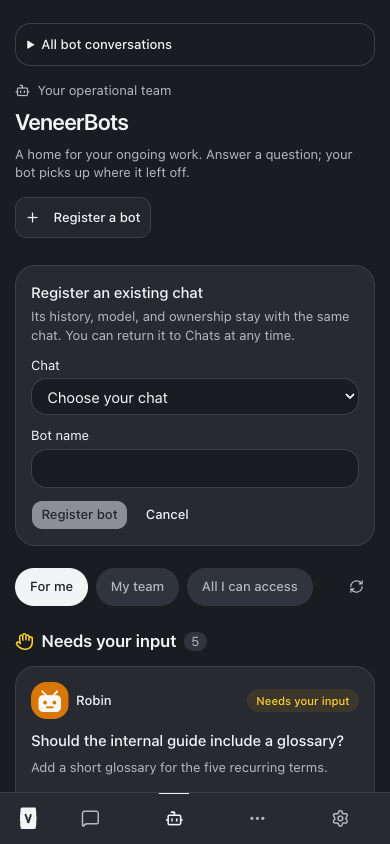

# VeneerBots conversation UX — build 78

Implemented September 19, 2026. Source checks and browser validation passed. Deployment status: build complete; required restart pending.

## What changed

All accessible registered bots are browsable in a persistent desktop conversation rail, including beside a selected decision or native conversation. Mobile has an expandable, scrollable “All bot conversations” list at the top and returns from chat to the Bots home. Search matches bot names and existing conversation titles. Rows show the original chat title, last activity date, unread marker, runtime state, and raised-hand count.

Stable colorful SVG robot avatars derive from existing conversation IDs and appear in the rail, roster, decision cards, decision header, and native chat header. No images, registrations, new conversations, models, or ownership changes were introduced.

Three dots appear only on new streamed reply text. Tool activity, final text, turn completion, failure, approval/question pauses, and connection loss clear them; eight seconds without another text delta is a conservative backstop. Reduced-motion users get static dots with an accessible “Composing a reply” label. Providers without streamed text show their work state instead. A previously emitted text delta in a snapshot does not imply ongoing typing.

A new lightweight WebSocket `observe` subscription uses existing authenticated conversation ACL checks. It transmits event types and a content-free text-activity marker, never transcript content. Observers do not mark conversations read or count as active readers at turn completion. The client upgrades to a normal subscription only when the actual chat is open, downgrades when it closes, and clears presence on disconnect. Revoked access removes both subscription types.

The rail exposes the existing reversible registration workflow. No operational identities were guessed or enrolled. Nick’s subsequently authorized business fleet model and ERVP bulk enrollment are reserved for the next queued build, after this build completes.

## Validation

- Typecheck passed: [output](./typecheck.txt).
- Full `npm test` passed: **2,844 passed, 5 existing skipped** — installer 21; server 1,998; web 785; browser manager 40. [Output](./full-tests.txt).
- Targeted WebSocket/bot tests: [output](./server-tests.txt); UI activity tests: [output](./web-tests.txt); final avatar checks: [output](./avatar-tests.txt).
- Production build passed, with the existing Vite large-chunk advisory: [output](./build.txt).
- Browser tests used an isolated in-memory database, deterministic adapter, real conversation manager and authenticated WebSocket handler, and production React components. Desktop 1440×1000 and mobile 390×844: list/search, stable identity, native chat route, working → streamed reply → available, reduced motion, disconnect clearing, registration discovery, no horizontal overflow or browser exceptions. [Output](./browser-tests.txt).
- Existing decision regression passed: six persistent questions, same-owner thread reply, approve → verified completion, dismissal retains result, team filter, viewer cannot approve, changed proposal disables stale approval and clears its draft, defer does not execute, reversible fixture registration. [Output](./decision-regression.txt).
- Observer integration tests verify unread preservation, no transcript content in presence events, and access revocation. Activity tests cover tool/completion/error/pause boundaries.

Reproduce with Node 24 on PATH. Start `node --import tsx scripts/bots-browser-fixture.ts`, then run `node scripts/bots-ux-browser-check.mjs <playwright-module-path>`. The prior decision checks accept a separate screenshot output directory: `node scripts/bots-browser-check.mjs <playwright-module-path> docs/reports/veneer-bots-ux/screenshots`. Fixture endpoints exist only in the standalone test server, never production.

## Screenshots

## Adoption and boundaries

No database migration is required. The deployment requires the normal root `npm run restart` after successful checks/build; this restarts the web, runner, app-runner, terminal and browser-manager services. Both web and runner must adopt the new source together. No direct system service manager commands are used.

Existing registrations automatically use the new rail and avatars. The existing registration form remains supported for explicitly selected owned chats, preserving native IDs and provider continuity. The newly authorized 13-chat ERVP fleet enrollment will use the next build’s delegated business-team tooling, not individual clicks, guessed enrollment, human impersonation, or direct database writes.

No real customer or finance tests, sends, approvals, or synthetic registrations occurred. Grant’s RZ99W6 decision remains untouched. Sol ownership and Astra effort were not changed. No AGENTS.md or CLAUDE.md changes.

Known limits: rows show conversation titles rather than copying message bodies into previews; typing indicates observed reply streaming, not unseen provider thought. Registration remains the v1 form until the separately authorized team build. Business switching, delegated team management, and bulk enrollment are not part of build 78.

## Changed source and test files

- [scripts/bots-browser-check.mjs](/Users/archerclawdington/veneer-os/scripts/bots-browser-check.mjs)
- [scripts/bots-browser-fixture.ts](/Users/archerclawdington/veneer-os/scripts/bots-browser-fixture.ts)
- [scripts/bots-ux-browser-check.mjs](/Users/archerclawdington/veneer-os/scripts/bots-ux-browser-check.mjs)
- [server/src/bots/routes.ts](/Users/archerclawdington/veneer-os/server/src/bots/routes.ts)
- [server/src/channels/webSocket.ts](/Users/archerclawdington/veneer-os/server/src/channels/webSocket.ts)
- [server/test/webSocketAccess.test.ts](/Users/archerclawdington/veneer-os/server/test/webSocketAccess.test.ts)
- [server/test/webSocketUnread.test.ts](/Users/archerclawdington/veneer-os/server/test/webSocketUnread.test.ts)
- [web/src/App.tsx](/Users/archerclawdington/veneer-os/web/src/App.tsx)
- [web/src/components/BotConversationRail.tsx](/Users/archerclawdington/veneer-os/web/src/components/BotConversationRail.tsx)
- [web/src/components/BotIdentity.test.tsx](/Users/archerclawdington/veneer-os/web/src/components/BotIdentity.test.tsx)
- [web/src/components/BotIdentity.tsx](/Users/archerclawdington/veneer-os/web/src/components/BotIdentity.tsx)
- [web/src/lib/bots.ts](/Users/archerclawdington/veneer-os/web/src/lib/bots.ts)
- [web/src/lib/ws.ts](/Users/archerclawdington/veneer-os/web/src/lib/ws.ts)
- [web/src/screens/Bots.tsx](/Users/archerclawdington/veneer-os/web/src/screens/Bots.tsx)
- [web/src/screens/Chat.tsx](/Users/archerclawdington/veneer-os/web/src/screens/Chat.tsx)
- [web/test/bots-browser.tsx](/Users/archerclawdington/veneer-os/web/test/bots-browser.tsx)

- [web/src/lib/ws.test.ts](/Users/archerclawdington/veneer-os/web/src/lib/ws.test.ts)

## Validation artifacts

- [avatar-tests.txt](/Users/archerclawdington/veneer-os/docs/reports/veneer-bots-ux/avatar-tests.txt)
- [browser-tests.txt](/Users/archerclawdington/veneer-os/docs/reports/veneer-bots-ux/browser-tests.txt)
- [build.txt](/Users/archerclawdington/veneer-os/docs/reports/veneer-bots-ux/build.txt)
- [decision-regression.txt](/Users/archerclawdington/veneer-os/docs/reports/veneer-bots-ux/decision-regression.txt)
- [full-tests.txt](/Users/archerclawdington/veneer-os/docs/reports/veneer-bots-ux/full-tests.txt)
- [server-tests.txt](/Users/archerclawdington/veneer-os/docs/reports/veneer-bots-ux/server-tests.txt)
- [typecheck.txt](/Users/archerclawdington/veneer-os/docs/reports/veneer-bots-ux/typecheck.txt)
- [web-tests.txt](/Users/archerclawdington/veneer-os/docs/reports/veneer-bots-ux/web-tests.txt)
