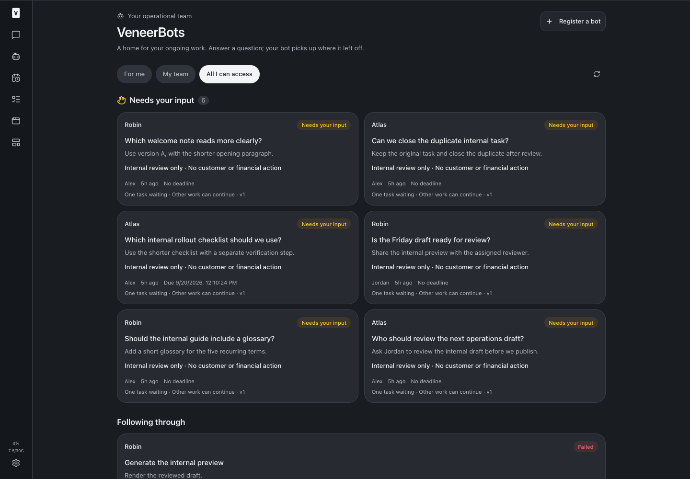
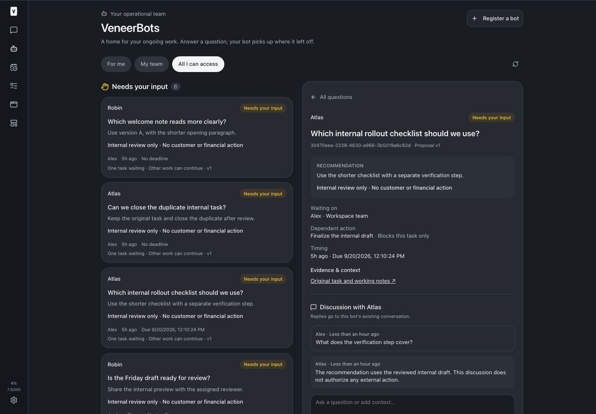
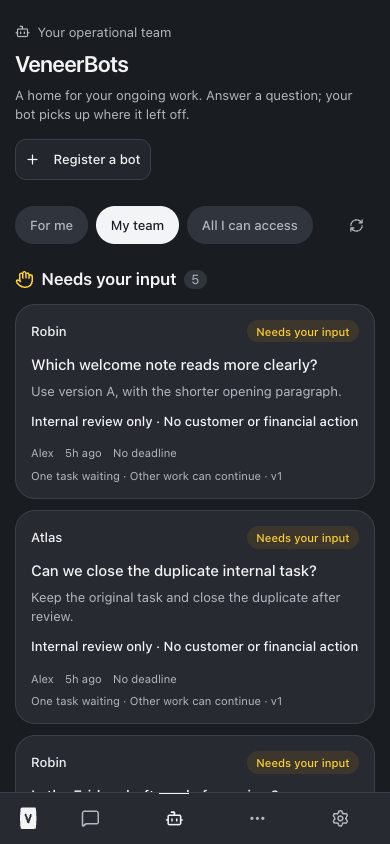
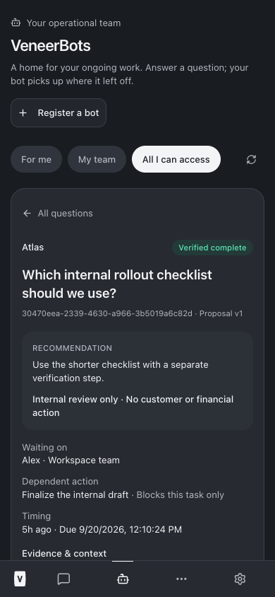
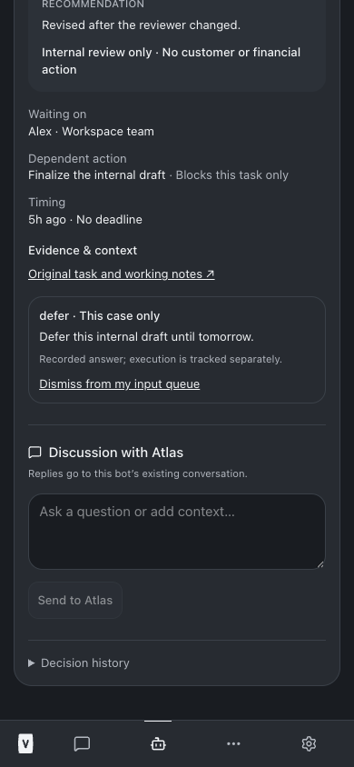
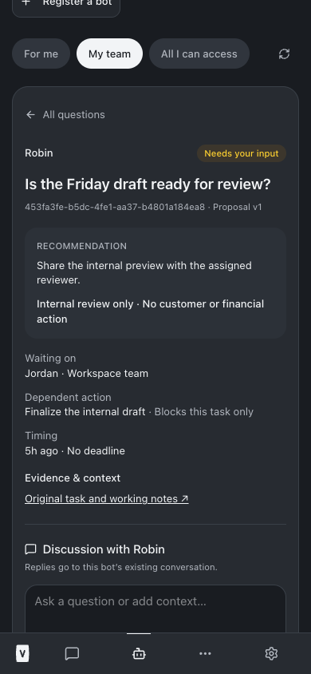
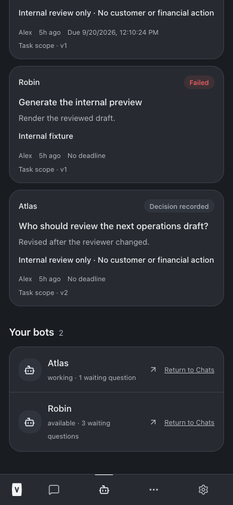

# VeneerBots implementation report

Built the first-class VeneerBots home, persistent human decisions, dedicated discussion threads, reversible chat registration, and durable replies to the existing bot executor. All implementation validation passed on September 19, 2026.

## What was built

- VeneerBots is directly accessible in the desktop rail and mobile bottom bar. Automations remains in the mobile More menu. Needs your input appears above the roster, with separate execution tracking below the unanswered questions.
- Registering an existing chat changes only bot metadata. Native session, chat identity, provider, model, ownership, project, and history remain intact. Registered bots disappear from the default build/project lists and are exempt from inactivity auto-archive. Return to Chats reverses registration; decision history remains available.
- Each decision has a stable ID, source/proposal dedupe keys, proposal version, question, recommendation, consequence, assigned human, team label, real optional deadline, evidence references, blocked action, and task/workload scope. Reading a card does not resolve it.
- Humans can discuss, amend, approve, reject, defer, withdraw, or dismiss an answered question from their input queue. Answer scope and actor are recorded. Execution status remains visible after dismissal.
- The state sequence distinguishes needs_input, decided, action_pending, running, verified_completed, blocked, and failed. Only an approved, dispatched, current proposal can enter running; the bot must attest that material evidence is unchanged. Completion requires an explicit bot result with evidence. Rejection, deferral, and withdrawal do not authorize execution.
- Answers and discussion create durable events and immediate wake rows in the same SQLite transaction. The existing runner dispatcher delivers to the same conversation, queues safely behind active work, and uses existing durable receipts to deduplicate retries. There is no second executor or arbitrary scheduled polling job.
- Server-side access follows the existing conversation Team/Private rules. Only the assigned human may answer; an agent token cannot impersonate a human. Current evidence access and active approver access are checked again before execution. Superseded resumes are suppressed. Canceled answer delivery stays visibly blocked.
- Immutable audit events preserve proposals, answers, scope, actors, discussion, parking receipts, and execution transitions. Historical proposal context is redacted from responses when its evidence becomes inaccessible.
- Agent tools: raise_decision, update_decision, list_decisions, reply_to_decision, record_decision_result, and park_decision_work. list_decisions exposes eligible human approver IDs. Bots may continue unrelated work while a task waits.

## Validation

All commands ran with Node 24 by prepending `/opt/homebrew/opt/node@24/bin` to PATH. The shell's default Node 22 binary has a missing Homebrew simdjson library; no system configuration was changed.

| Check | Result |
| --- | --- |
| npm run typecheck | Passed |
| npm test: installer | 21 passed |
| npm test: server | 1,996 passed, 5 existing skips; 183 files |
| npm test: web | 782 passed; 111 files |
| npm test: browser manager | 40 passed |
| Total full-suite assertions | 2,839 passed, 5 skipped |
| npm run build | Passed; existing large-chunk advisory remains |
| Automated browser verification | Passed at 1440×1000 and 390×844 |
| git diff --check | Passed |

The new service/API tests cover six questions across two permanent fixture bots, five-hour persistence (simulated timestamps), read-without-disposition, reversible registration, auto-archive exemption, source/proposal dedupe, agent spoofing, assigned-human enforcement, stale/conflicting answers, immutable audit, unchanged-evidence checks, execution transitions, continued unrelated work, dedicated threaded replies, exactly one answer delivery, crash-after-enqueue recovery, failed status after dismissal, evidence ACL, revoked approval access, altered retry rejection, team filters, and blocked delivery after unregistration.

The automated browser check exercised six unanswered questions, threaded clarification and bot reply, approval followed by verified completion, dismissal with status retained, team filtering, view-only access without approval controls, stale proposal disabling approval, draft clearing on explicit revision review, deferral without execution, reversible registration, desktop/mobile overflow, and browser exceptions. It uses real production UI components and API/service code with an in-memory database and a deterministic provider adapter. It contacts no customers and performs no financial actions. It is a fixture validation, not a live customer workflow test.

- [Typecheck output](/Users/archerclawdington/veneer-os/docs/reports/veneer-bots/typecheck.log)
- [Full test output](/Users/archerclawdington/veneer-os/docs/reports/veneer-bots/tests.log)
- [Build output](/Users/archerclawdington/veneer-os/docs/reports/veneer-bots/build.log)
- [Browser output](/Users/archerclawdington/veneer-os/docs/reports/veneer-bots/browser.log)

## Screenshots

All screenshots show isolated internal fixture bots, not Henry, Grant, Astra, or the Sol CS bots.

### Desktop home

### Desktop discussion

### Mobile home

### Mobile completion

### Mobile decision thread

### Mobile viewer permissions

### Mobile roster and execution failures

## Deployment and adoption

Validation and production build are complete. Service restart outcome will be recorded below. The platform finish instructions require `npm run restart` only after successful typecheck, tests, and build; no mid-build restart was performed.

Migration 0091 is additive and creates empty bot/decision tables. It does not register real bots, approve a decision, release any external lease, send a customer message, or modify models. Services apply it through the existing migration mechanism when they start. No installer or separate release step is needed.

After the updated services are available, open VeneerBots → Register a bot while signed in as the existing chat owner. Choose the existing native operational chat and set its display name. Do not create replacement chats. Known chat IDs from the brief:

| Bot | Existing chat |
| --- | --- |
| Henry | 2c5de4ad-00b4-4be2-abf7-25f34eb787a3 |
| Grant | cb4ade24-c960-4235-956a-220260e5adac |
| Astra | Select its existing chat; retain medium effort |
| Five Sol CS bots | Register each existing owned chat; do not transfer ownership |

Registration does not start a turn. At the bot's next authorized turn, use list_decisions to discover eligible approvers, then raise_decision with a stable source/proposal key. For changed material evidence use update_decision; old approval cannot be reused. For discussion replies use reply_to_decision so the response is also stored in the dedicated thread. Before action, read the latest decision, recheck material evidence, and record running. Finish with evidence-backed verified_completed, blocked, or failed.

Grant's RZ99W6 escalation (78b88e47-7871-4db7-a95a-4376e26cf182) was not read, modified, or synthetically approved. No live operational registrations, ownership changes, or Astra effort changes were made by this build.

## Boundaries and known limitations

- This repository has one existing workspace Team/Private ACL, not a separate organizational team-membership model. My team uses shared Team chats; the proposal team string is descriptive and never grants authority.
- Evidence references link to existing ACL-protected conversations. Put files or case evidence in their owning chat/context. This v1 does not invent an independent public evidence-sharing system.
- There is no ticket/case lease backend in this source checkout. park_decision_work records receipts for leases already released through their owning system; it does not claim to release third-party leases. Bots must call the existing authorized case/ticket system first, then record the release evidence. No finance/customer integration was invoked to test this.
- Scope set to standing rule records human intent only. Existing policy, money, connector, and tool approval gates remain in effect.
- verified_completed is an explicit evidence-bearing report from the owning bot, not an automatic assertion that a human answer completed the work.
- The browser fixture uses a deterministic adapter; it validates runtime/UI contracts without using a real provider subscription or customer workflow. Pending work during a service restart remains subject to the existing runner recovery semantics.

## Files changed

- [Persistent schema](/Users/archerclawdington/veneer-os/server/src/db/migrations/0091_veneer_bots.sql)
- [Decision state, ACL, audit, and idempotency](/Users/archerclawdington/veneer-os/server/src/bots/service.ts)
- [Human and bot API](/Users/archerclawdington/veneer-os/server/src/bots/routes.ts)
- [Durable delivery checks](/Users/archerclawdington/veneer-os/server/src/bots/delivery.ts)
- [Agent tool contracts](/Users/archerclawdington/veneer-os/server/src/mcp/botTools.ts)
- [Agent tool registration](/Users/archerclawdington/veneer-os/server/src/mcp/agentToolsServer.ts)
- [API integration and registration metadata](/Users/archerclawdington/veneer-os/server/src/routes/api.ts)
- [Bot auto-archive exemption](/Users/archerclawdington/veneer-os/server/src/routes/chatAutoArchive.ts)
- [Existing wake dispatcher integration](/Users/archerclawdington/veneer-os/server/src/scheduled/wakeups.ts)
- [Service, API, concurrency, and recovery tests](/Users/archerclawdington/veneer-os/server/test/bots.test.ts)
- [VeneerBots screen](/Users/archerclawdington/veneer-os/web/src/screens/Bots.tsx)
- [Typed browser API](/Users/archerclawdington/veneer-os/web/src/lib/bots.ts)
- [Conversation type](/Users/archerclawdington/veneer-os/web/src/lib/types.ts)
- [Routes and return navigation](/Users/archerclawdington/veneer-os/web/src/App.tsx)
- [Desktop and mobile navigation](/Users/archerclawdington/veneer-os/web/src/components/NavBar.tsx)
- [Navigation regression tests](/Users/archerclawdington/veneer-os/web/src/components/NavBar.test.tsx)
- [Build chat filtering](/Users/archerclawdington/veneer-os/web/src/screens/ChatList.tsx)
- [Project chat filtering](/Users/archerclawdington/veneer-os/web/src/screens/ProjectView.tsx)
- [Isolated browser fixture server](/Users/archerclawdington/veneer-os/scripts/bots-browser-fixture.ts)
- [Automated browser verification](/Users/archerclawdington/veneer-os/scripts/bots-browser-check.mjs)
- [Production-component fixture entry](/Users/archerclawdington/veneer-os/web/test/bots-browser.tsx)

## Service restart outcome

Pending the platform-required final restart.
