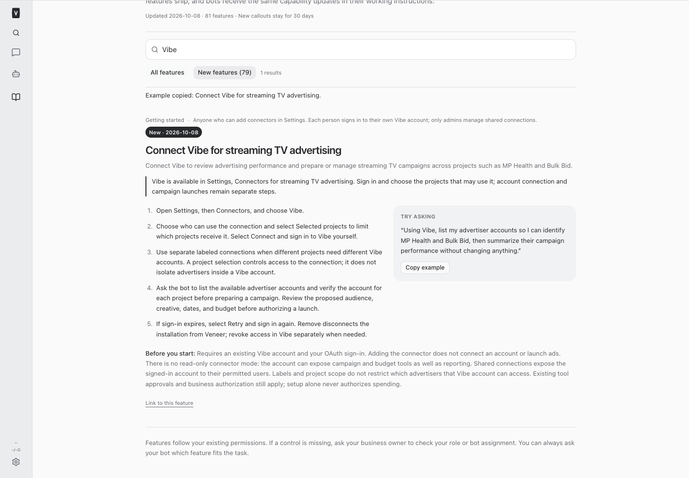
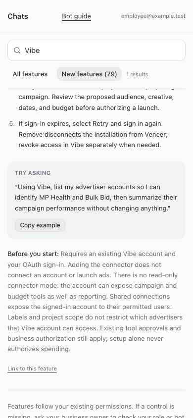

# Vibe MCP — build 646

Vibe is integrated with the existing OAuth remote MCP connector. Personal/shared access,
multiple labeled installations and project restrictions use the existing connector controls.
A label or project assignment does not restrict advertisers inside a Vibe account.

## Setup

Open Settings → Connectors → Vibe. Choose access and Selected projects, then Connect.
The human must sign in to their Vibe account. After connection, ask for a read-only list
of advertiser accounts and confirm the accounts for MP Health and Bulk Bid before campaign work.
No live account sign-in, campaign, spend or advertiser mapping was performed by this build.
There is no read-only Vibe connector mode; existing approvals and explicit business authorization remain required.

## Compatibility and verification

On October 8, 2026, public HTTPS reads verified the protected resource at
`https://api.vibe.co/.well-known/oauth-protected-resource/mcp` and authorization metadata at
`https://api.vibe.co/.well-known/oauth-authorization-server`.
The resource advertises `offline_access mcp:tools mcp:resources`; authorization metadata
advertises dynamic registration, public clients (`none`), S256 PKCE, code and refresh grants.
The endpoint is `https://api.vibe.co/mcp`. Actual user sign-in and account tool discovery
remain untested until the human connects. OAuth lifecycle tests use an injected provider,
and a separate fixture verifies the observed Vibe metadata shape and registration scope.

Typecheck passed. Employee UI checks passed at 1440-pixel desktop and 390-pixel mobile,
with full/restricted fixtures, search, new announcement, example copying and overflow checks.
Guide contract tests verify current instructions reach fresh/resumed agent contexts.
The initial full test run found the catalog enumeration needed the new Vibe entry;
that expectation was updated before rerunning.

Final validation passed: root typecheck; 3,790 server tests (15 skipped), 1,013 web
tests, 30 installer tests and 51 browser-manager tests; production build.
The build reported its existing large-chunk advisory. All five services restarted:
the initial restart renewed web and runner before interrupting this chat; their new
process start times and healthy endpoints were verified before restarting only the
remaining app-runner, terminal and browser-manager through the supported restart command.
Local web/runner and the remaining service health checks passed. The public front door
returned HTTP 302 and the tunnel reported four active edge connections; these are
reachability checks, not authenticated public chat or Vibe account verification.

## Screenshots

## Changed files

- [server/src/connectors/catalog.ts](/Users/archerclawdington/veneer-os/server/src/connectors/catalog.ts)
- [server/src/featureGuide/catalog.ts](/Users/archerclawdington/veneer-os/server/src/featureGuide/catalog.ts)
- [web/src/screens/Connectors.tsx](/Users/archerclawdington/veneer-os/web/src/screens/Connectors.tsx)
- [server/test/remoteMcp.test.ts](/Users/archerclawdington/veneer-os/server/test/remoteMcp.test.ts)
- [server/test/connectorsRoutes.test.ts](/Users/archerclawdington/veneer-os/server/test/connectorsRoutes.test.ts)
- [server/test/botFeatureGuide.test.ts](/Users/archerclawdington/veneer-os/server/test/botFeatureGuide.test.ts)
- [scripts/vibe-connector-browser-check.mjs](/Users/archerclawdington/veneer-os/scripts/vibe-connector-browser-check.mjs)
- [docs/bot-feature-guide.md](/Users/archerclawdington/veneer-os/docs/bot-feature-guide.md)
- [docs/reports/vibe-connector/desktop.png](/Users/archerclawdington/veneer-os/docs/reports/vibe-connector/desktop.png)
- [docs/reports/vibe-connector/employee-mobile.png](/Users/archerclawdington/veneer-os/docs/reports/vibe-connector/employee-mobile.png)
