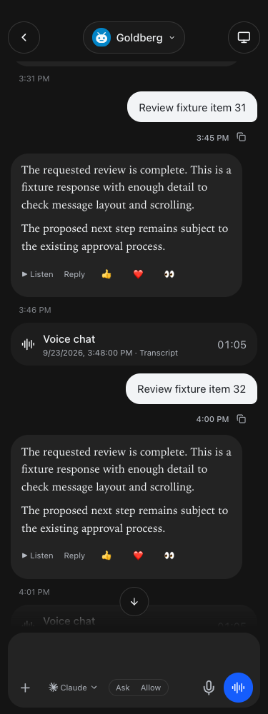
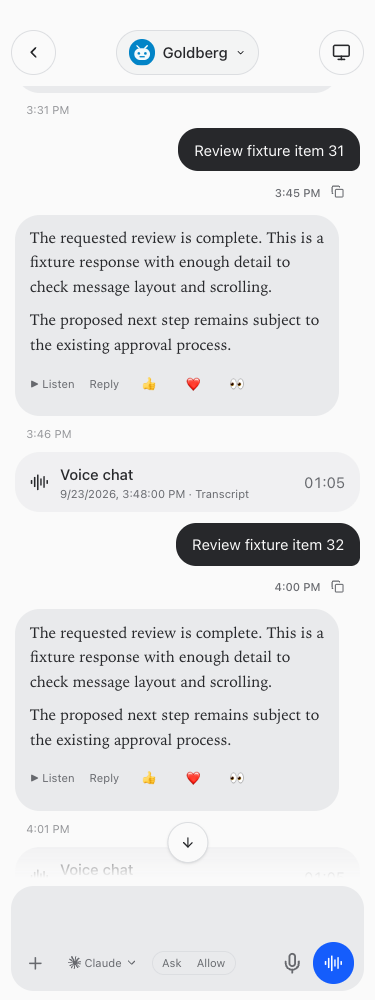
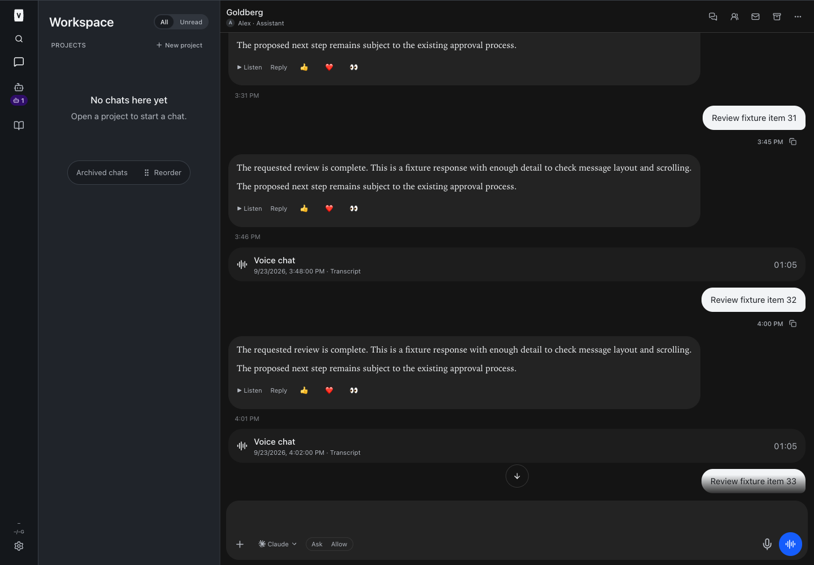

# Voice chats in chronological order — BUILD262

Deployed implementation **d4e30da**, pushed to origin main. Saved voice chats now appear among messages at each call's recorded start time instead of collecting at the bottom. Existing duration, outcome and private transcript controls remain intact.

The timeline inserts calls without sorting or retimestamping transcript rows. Frozen static blocks split at insertion boundaries; image/Mermaid rows stay mounted, and live/streaming/pending messages retain their existing behavior. Equal-time calls use deterministic IDs. Older-call pagination merges and deduplicates records; late responses from another chat are ignored. If legacy messages have no usable timestamps, the UI explicitly states that relative placement is unavailable rather than inventing times.

Validation: root typecheck, full tests and production build passed before restart. **2,354 server tests passed (5 skipped), 872 web tests, 40 browser-manager tests, 21 installer tests.** Focused timeline/frozen-render tests: 13 passed. Full-app mocked browser checks passed at 320/375/414/768/1440 pixels in light and dark themes, covering interleaving through frozen history, new-call refresh, transcript keyboard opening/closing, earlier-page loading, stale chat-switch responses and overflow. Full/restricted guide fixtures and resumed instruction tests passed. No live calls, customer messages or business actions were used.

Root restart began **2026-09-23T20:11:34.749605Z**. Web, runner, app-runner, terminal and browser-manager all returned healthy; independent read-only probes returned HTTP200 on all five services. Built guide confirms the chronological-placement New announcement and resumed-agent guidance. Unrelated untracked workspace directories were preserved.

## Changed files

- [docs/reports/voice-timeline/timeline-1440-dark.png](/Users/archerclawdington/veneer-os/docs/reports/voice-timeline/timeline-1440-dark.png)
- [docs/reports/voice-timeline/timeline-375-dark.png](/Users/archerclawdington/veneer-os/docs/reports/voice-timeline/timeline-375-dark.png)
- [docs/reports/voice-timeline/timeline-375-light.png](/Users/archerclawdington/veneer-os/docs/reports/voice-timeline/timeline-375-light.png)
- [scripts/voice-timeline-browser-check.mjs](/Users/archerclawdington/veneer-os/scripts/voice-timeline-browser-check.mjs)
- [server/src/featureGuide/catalog.ts](/Users/archerclawdington/veneer-os/server/src/featureGuide/catalog.ts)
- [web/src/components/VoiceSessions.tsx](/Users/archerclawdington/veneer-os/web/src/components/VoiceSessions.tsx)
- [web/src/lib/voiceTimeline.test.ts](/Users/archerclawdington/veneer-os/web/src/lib/voiceTimeline.test.ts)
- [web/src/lib/voiceTimeline.ts](/Users/archerclawdington/veneer-os/web/src/lib/voiceTimeline.ts)
- [web/src/screens/Chat.tsx](/Users/archerclawdington/veneer-os/web/src/screens/Chat.tsx)
- [Release report](/Users/archerclawdington/veneer-os/docs/reports/voice-timeline/README.md)
